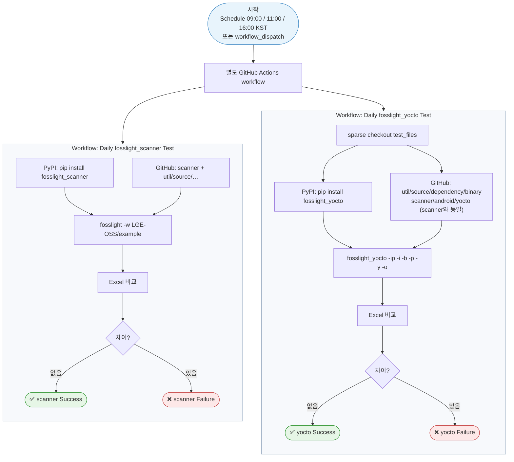
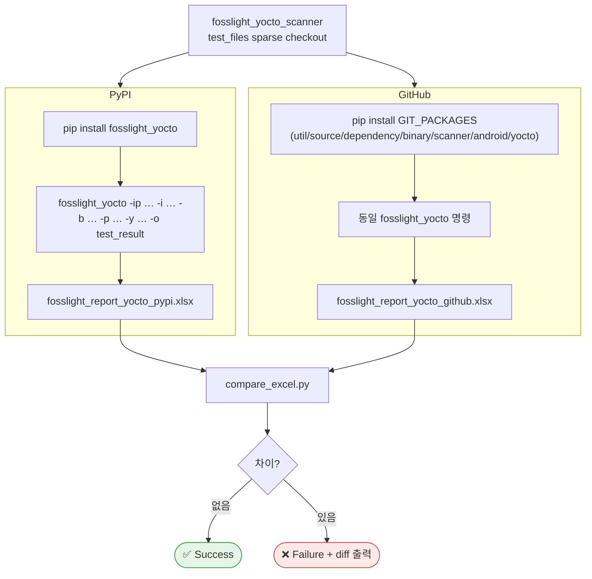
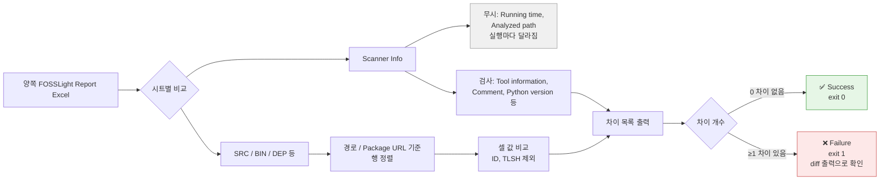

# FOSSLight Scanner Test — Flowchart

이 문서는 PyPI 설치본과 GitHub 설치본의 스캔 결과를 비교하는 전체 흐름을 설명합니다.

## Overview

> **판정 기준**
> - **차이 없음** → 해당 workflow Success
> - **차이 있음** → 해당 workflow Failure + diff 출력
> - scanner / yocto workflow는 **독립** 실행·판정

## Detail — fosslight_yocto

## Detail — 비교 판정

## Related files

| Path | Role |
|------|------|
| [`scripts/run_scanner_test.sh`](../scripts/run_scanner_test.sh) | fosslight_scanner 비교 |
| [`scripts/run_yocto_test.sh`](../scripts/run_yocto_test.sh) | fosslight_yocto 비교 |
| [`scripts/run_daily_test.sh`](../scripts/run_daily_test.sh) | 로컬에서 둘 다 실행(선택) |
| [`scripts/compare_excel.py`](../scripts/compare_excel.py) | Excel 셀/행 비교 |
| [`scripts/common.sh`](../scripts/common.sh) | 공통 헬퍼 |
| [`.github/workflows/daily_scanner_test.yml`](../.github/workflows/daily_scanner_test.yml) | scanner CI |
| [`.github/workflows/daily_yocto_test.yml`](../.github/workflows/daily_yocto_test.yml) | yocto CI |
