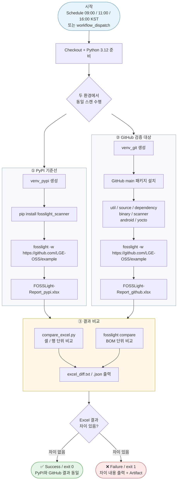
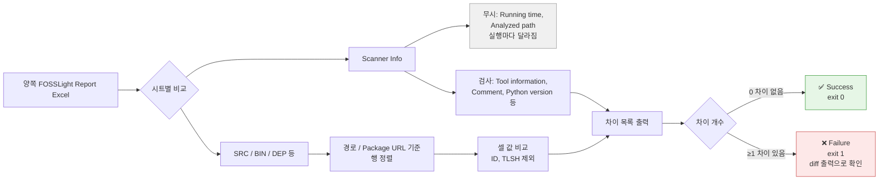
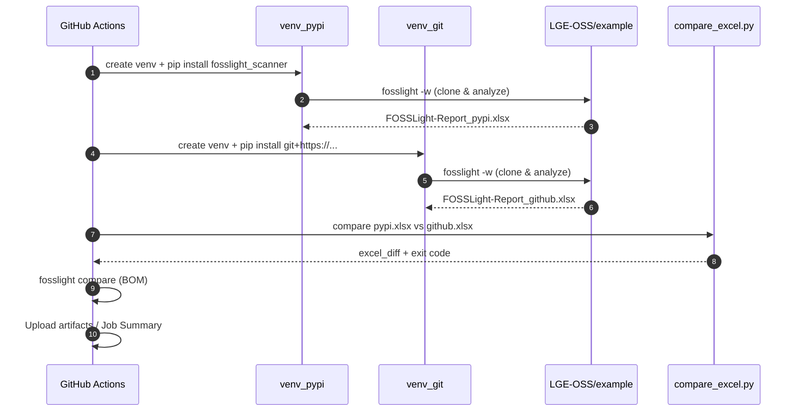

# FOSSLight Scanner Test — Flowchart

이 문서는 PyPI 설치본과 GitHub 설치본의 스캔 결과를 비교하는 전체 흐름을 설명합니다.

## Overview

> **판정 기준**
> - **차이 없음** → Success (Failure가 아님)
> - **차이 있음** → Failure이며, 달라진 값을 로그/`excel_diff`로 출력해 확인 가능

## Detail — 비교 판정

## Sequence

## Related files

| Path | Role |
|------|------|
| [`scripts/run_daily_test.sh`](../scripts/run_daily_test.sh) | 설치 · 스캔 · 비교 오케스트레이션 |
| [`scripts/compare_excel.py`](../scripts/compare_excel.py) | Excel 셀/행 비교 |
| [`.github/workflows/daily_scanner_test.yml`](../.github/workflows/daily_scanner_test.yml) | 스케줄 / 수동 실행 CI |
